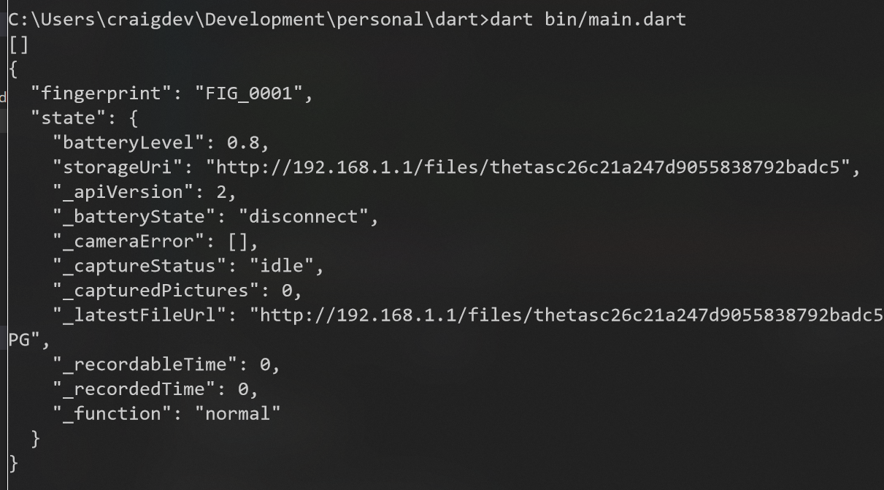

# RICOH THETA Dart HTTP Request tests

RICOH THETA API requests for models V, Z1, and SC2. [API reference](https://api.ricoh/docs/theta-web-api-v2.1/)


Read about [why we're using Dart](doc/dart-growth/dart.md).

## Usage

1. connect workstation to THETA with camera in access point (AP) mode
2. open `main.dart` in an editor and uncomment the function you want to use
3. run `main.dart` file in `bin`

    dart bin/main.dart

### POST example

response from THETA SC2




### Take Picture Example

If you send a payload such as `{'name': 'camera.takePicture'}` as part of your 
request, you must encode the body as JSON.  You can use `json.encode(your-payload-object)` 
or the new `jsonEncode()` https://api.dart.dev/stable/2.7.1/dart-convert/jsonEncode.html


Test from THETA V.  OK!


Test from THETA SC2.  OK!

Response from SC@ shown below.

```javascript
C:\Users\craigdev\Development\personal\dart>dart bin/main.dart
[]
200
{
  "name": "camera.takePicture",
  "id": "1588",
  "progress": {
    "completion": 0.0
  },
  "state": "inProgress"
}
```

### List Files

https://api.ricoh/docs/theta-web-api-v2.1/commands/camera.list_files/

This shows a more complex nested payload with parameters.

Response

```javascript
$ dart bin/main.dart 
[]
200
{
  "name": "camera.listFiles",
  "results": {
    "entries": [
      {
        "dateTimeZone": "2020:03:18 17:12:32-07:00",
        "fileUrl": "http://192.168.1.1/files/150100525831424d42079d18e0b6c300/100RICOH/R0010024.JPG",
        "height": 2688,
        "isProcessed": true,
        "name": "R0010024.JPG",
        "previewUrl": "",
        "_projectionType": "Equirectangular",
        "size": 4362617,
        "_thumbSize": 2749,
        "width": 5376
      },
```
### Get Options

The camera options you want to get need to be specified individually in an array.
I do not think you can get all the options with a wildcard or "all" specification.

Format of the data request is below.

```javascript
var url ='http://192.168.1.1/osc/commands/execute';

  Map data = {
    'name': 'camera.getOptions',
    'parameters': {
      'optionNames': [
        "iso",
        "isoSupport"
      ]
    }
```

Response from a THETA SC2 running firmware 1.20 is shown below.

```javascript
{
  "name": "camera.getOpions",
  "state": "done",
  "results": {
    "options": {
      "iso": 0,
      "isoSupport": [
        64,
        80,
        100,
        125,
        160,
        200,
        250,
        320,
        400,
        500,
        640,
        800,
        1000,
        1250,
        1600,
        2000,
        2500,
        3200
      ]
    }
  }
}
```

#### Addtional Options

In my tests, there are significant differences between the THETA V options
and the options for SC2.  In your tests, you can try each option individually
to see what is supported.

Note that in the test of the SC2 below, the previewFormat is not returning 
the correct values.

The payload is:

```javascript
Map data = {
    'name': 'camera.getOptions',
    'parameters': {
      'optionNames': [
        "offDelay",
        "sleepDelay",
        "remainingSpace",
        "_colorTemperature",
        "previewFormat"
      ]
    }
  };
```

The response from a THETA SC2 running firmware 1.20 is shown below.  Note
that the `previewFormat` is giving 0 values.  This API is likely
not supported at the moment.

```javascript
{
  "name": "camera.getOpions",
  "state": "done",
  "results": {
    "options": {
      "offDelay": 65535,
      "sleepDelay": 65535,
      "remainingSpace": 2168410112,
      "_colorTemperature": 2500,
      "previewFormat": {
        "width": 0,
        "height": 0
      },
      "framerate": 0
    }
  }
}
```

For comparison, this is the response from a THETA V.  See the difference in the
previewFormat information.


## Camera Firmware Tested

* Z1 1.31.1
* RICOH THETA SC 1.20
* V 3.21.1


## Troubleshooting Camera

### Testing Connection with GET info

The simplest command to the camera is GET info.

You can test it in a browser, curl, Postman.  In the test program, you can
look for the URL below.

    String url = 'http://192.168.1.1/osc/info';

If you are having problems getting a camera connection and want to test your
code with a known working API that returns a single JSON object, you can use a public Internet test server to return a single JSON object and print it out.

    // String url = 'https://swapi.co/api/people/1';
    // String url = 'https://jsonplaceholder.typicode.com/users/1';

## Configuration and Installation

1. install [dart](https://dart.dev/)
2. clone this repo
3. run `pub get` to install dependencies

```
$ pub get
Resolving dependencies... (1.2s)
Downloading args 1.5.3...
Downloading http 0.12.0+4...
Downloading pedantic 1.9.0...
Downloading async 2.4.0...
Downloading source_span 1.6.0...
Downloading charcode 1.1.3...
Downloading meta 1.1.8...
Got dependencies!
```

## Additional Screenshots

### THETA V


## References

* [Dart HttpClient](https://itnext.io/learn-dart-perform-a-serverside-post-request-in-under-30-seconds-894fc889c551)
* [Pretty Print JSON](https://colinstodd.com/posts/code/pretty-print-json-in-dart.html)

## Notes

* [Jermaine Oppong's blog with lots of Dart info](https://itnext.io/@graphicbeacon)
* [Dart args package](https://pub.dev/packages/args)


