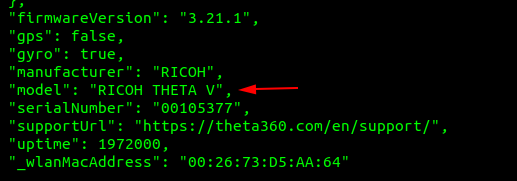

# RICOH THETA Dart HTTP Request tests

RICOH THETA API requests for models V, Z1, and SC2. [API reference](https://api.ricoh/docs/theta-web-api-v2.1/)


## Usage

1. connect workstation to THETA with camera in access point (AP) mode
2. open `main.dart` in an editor and uncomment the function you want to use
3. run `main.dart` file in `bin`

    dart bin/main.dart

### POST example

response from THETA SC2


## Camera Firmware Tested

* Z1 1.31.1
* RICOH THETA SC 1.20
* V 3.21.1


## Troubleshooting Camera

### Testing Connection with GET info

The simplest command to the camera is GET info.

You can test it in a browser, curl, Postman.  In the test program, you can
look for the URL below.

    String url = 'http://192.168.1.1/osc/info';

If you are having problems getting a camera connection and want to test your
code with a known working API that returns a single JSON object, you can use a public Internet test server to return a single JSON object and print it out.

    // String url = 'https://swapi.co/api/people/1';
    // String url = 'https://jsonplaceholder.typicode.com/users/1';

## Configuration and Installation

1. install [dart](https://dart.dev/)
2. clone this repo
3. run `pub get` to install dependencies

```
$ pub get
Resolving dependencies... (1.2s)
Downloading args 1.5.3...
Downloading http 0.12.0+4...
Downloading pedantic 1.9.0...
Downloading async 2.4.0...
Downloading source_span 1.6.0...
Downloading charcode 1.1.3...
Downloading meta 1.1.8...
Got dependencies!
```

## Additional Screenshots

### THETA V




## References

* [Dart HttpClient](https://itnext.io/learn-dart-perform-a-serverside-post-request-in-under-30-seconds-894fc889c551)
* [Pretty Print JSON](https://colinstodd.com/posts/code/pretty-print-json-in-dart.html)

## Notes

* [Jermaine Oppong's blog with lots of Dart info](https://itnext.io/@graphicbeacon)
* [Dart args package](https://pub.dev/packages/args)


