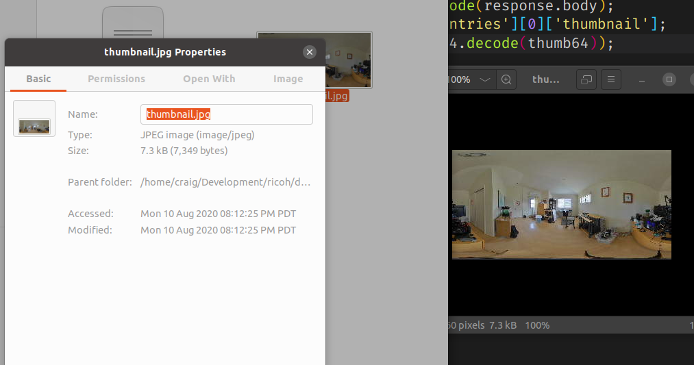

# RICOH THETA SC2 Image Thumbnails

## Problem

Using camera.listFiles does not return image thumbnails even
when the maxThumbSize is set to 640.  In community tests, the
SC2 hangs or freezes when 640 was specified as the maxThumbSize. No
thumbnail was returned.


## Workarounds Overview and Limitations

This article describes two different workarounds. Both techniques
will only return a single thumbnail.  To get all the 
thumbnails, you will need to implement
a loop and manage async issues for the network and camera.

## Workaround #1 - listFiles and _startFileUrl

### Quick Point

Grab the URL of the file you want to get the thumbnail for and 
then specify it in `_startFileUrl`.

### Overview

Using the 

### Example Request

Example in Dart map.

```dart
  Map data = {
    'name': 'camera.listFiles',
    'parameters': {
      'fileType': 'image',
      'entryCount': 1,
      'maxThumbSize': 640,
      '_detail': true,
      '_startFileUrl':
          'http://192.168.1.1/files/thetasc26c21a247d9055838792badc5/100RICOH/R0010129.JPG'
    }
```

### Example Response

This is the response from a THETA SC2. 

```json
200
{
  "name": "camera.listFiles",
  "results": {
    "entries": [
      {
        "name": "R0010129.JPG",
        "fileUrl": "http://192.168.1.1/files/thetasc26c21a247d9055838792badc5/100RICOH/R0010129.JPG",
        "size": 3943866,
        "isProcessed": true,
        "previewUrl": "",
        "dateTimeZone": "2020:08:01 15:07:50-07:00",
        "width": 5376,
        "height": 2688,
        "_thumbSize": 7349,
        "thumbnail": "/9j/2wCEAAsICAoIBwsKCQoNDAsNERwSEQ8PESIZGhQcKSQrKigkJyctMkA3LTA9MCcnOEw5PUNFSElIKzZPVU5GVEBHSEUBDA0NEQ8RIRISIUUuJy5FRUVFRUVFRUVFRUVFRUVFRUVFRUVFRUVFRUVFRUVFRUVFRUVFRUVFRUVFRUVFRUVFRf/EAaIAAAEFAQEBAQEBAAAAAAAAAAABAgMEBQYHCAkKCxAAAgEDAwIEAwUFBAQAAAF9AQIDAAQRBRIhMUEGE1FhByJxFDKBkaEII0KxwRVS0fAkM2JyggkKFhcYGRolJicoKSo0NTY3ODk6Q0RFRkdISUpTVFVWV1hZWmNkZWZnaGlqc3R1dnd4eXqDhIWGh4iJipKTlJWWl5iZmqKjpKWmp6ipqrKztLW2t7i5usLDxMXGx8jJytLT1NXW19jZ2uHi4+Tl5ufo
        ...
```

### Example Using the Thumbnail

The thumbnail is a base64 encoded string.  Most languages have a library to
decode base64 into bytes.  You can then display the thumbnail to your
mobile app screen or save it to disk.  In the following example,
the thumbnail is saved to disk.



```dart

/// returns base64 encoded string of the thumbnail
import 'dart:async';
import 'dart:convert';
import 'dart:io';
import 'package:http/http.dart' as http;
import 'package:apitest/pretty_print.dart';

Future<String> getThumb(imageUrl) async {
  var url = 'http://192.168.1.1/osc/commands/execute';

  Map data = {
    'name': 'camera.listFiles',
    'parameters': {
      'fileType': 'image',
      'entryCount': 1,
      '_startFileUrl': imageUrl,
      'maxThumbSize': 640,
      '_detail': true,
    }
  };
  //encode Map to JSON
  var body = jsonEncode(data);

  var response = await http.post(url,
      headers: {"Content-Type": "application/json;charset=utf-8"}, body: body);
  print("${response.statusCode}");
  prettyPrint("${response.body}");
  Map<String, dynamic> imageInfo = jsonDecode(response.body);
  String thumb64 = imageInfo['results']['entries'][0]['thumbnail'];
  File('thumbnail.jpg').writeAsBytes(base64.decode(thumb64));

  return thumb64;
}
```

## Workaround #2 - GET fileUrl with ?type=thumb

You must first get the URL of the file you want to get the thumbnail for.

Once you have the URL, you can get the thumbnail by 
adding `?type=thumb` to the end of the URL.

### Workaround #2 - Example Request

The example below accepts a single URL as a parameter.

```dart
import 'dart:async';
import 'dart:io';
import 'package:http/http.dart' as http;

Future<String> getThumb2(imageUrl) async {
  print(imageUrl);
  var response = await http.get('${imageUrl}?type=thumb',
      headers: {"Content-Type": "application/json;charset=utf-8"});
  print("${response.statusCode}");

  File('thumbnail.jpg').writeAsBytes(response.bodyBytes);

  return response.body;
}
```

### Example to get a list of URLs

This example shows how to get the last five image URLs on the 
camera and return it as a list.  You can then iterate through the
last and grab the thumbnail for each image.

```dart
/// list urls of images on camera
import 'dart:async';
import 'dart:convert';
import 'package:http/http.dart' as http;

var urls = [];

Future<List<dynamic>> listUrls() async {
  var url = 'http://192.168.1.1/osc/commands/execute';

  Map data = {
    'name': 'camera.listFiles',
    'parameters': {
      'fileType': 'image',
      'entryCount': 5,
      'maxThumbSize': 0,
      '_detail': true,
    }
  };
  //encode Map to JSON
  var body = jsonEncode(data);

  var response = await http.post(url,
      headers: {"Content-Type": "application/json;charset=utf-8"}, body: body);
  print("${response.statusCode}");
  var entries = await jsonDecode(response.body)["results"]["entries"];
  entries.forEach((element) {
    urls.add(element["fileUrl"]);
  });
  print(urls);
  return urls;
}
```

## Summary

There appears to be a bug in the SC2 API that prevents it from
returning thumbnails in the listing of listFiles. Additionally,
in some cases, the documented method of acquiring the thumbnail
may lock the camera. 
cd
Developers can acquire the thumbnail with one of two
workarounds. When using `listFiles`, 
specifying a String for `_startFileUrl` will give you a response with
a base64 String that needs to be decoded into bytes.  The 
bytes can be saved to storage or displayed to the mobile app
screen.

Adding `?type=thumb` to the end of the fileUrl and sending the
URL as a GET HTTP request will give you a binary image
file that you can display to the mobile app screen or save to local 
storage.

---
This tip and many more SC2 developer articles are available on the 
[SC2 Developers Community Site](https://theta360.guide/special/sc2/).
Markdown to PDF conversion done with [Grip](https://github.com/joeyespo/grip).